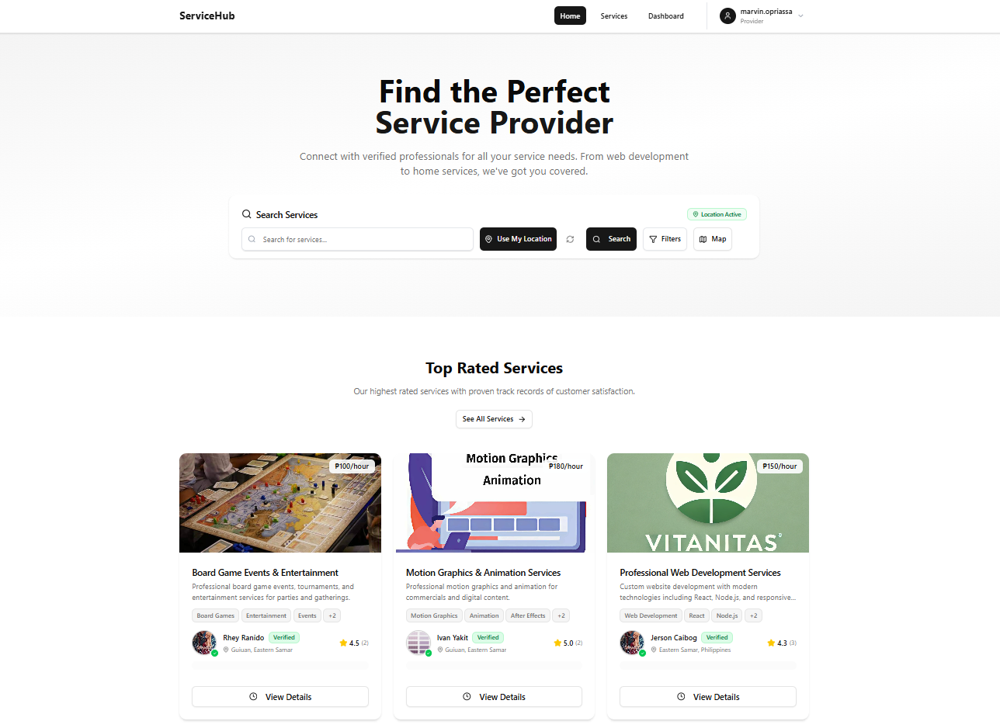
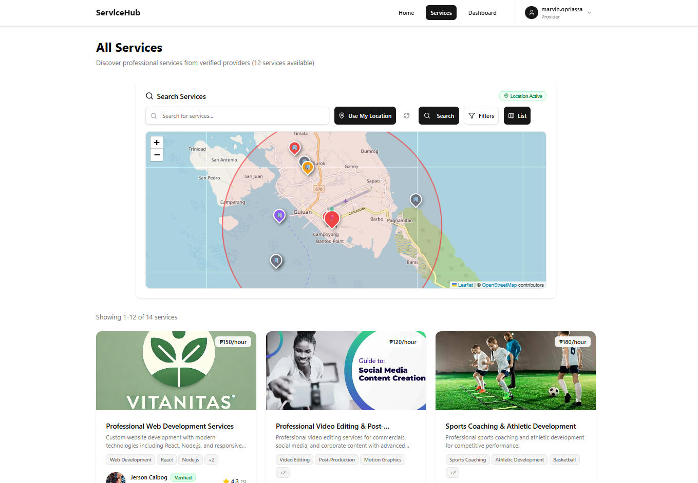
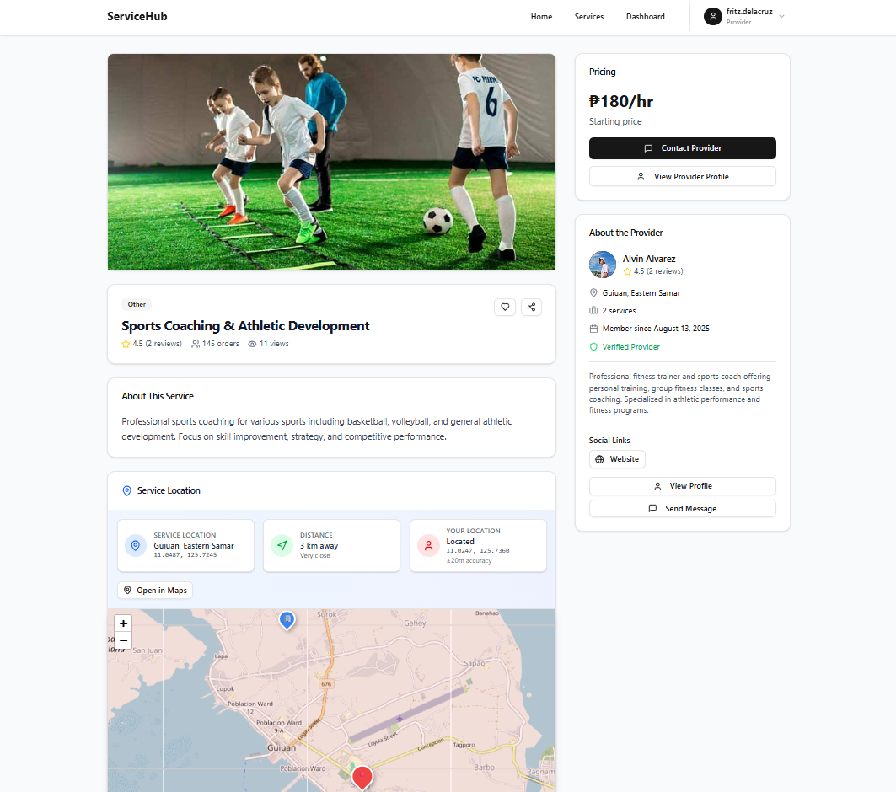
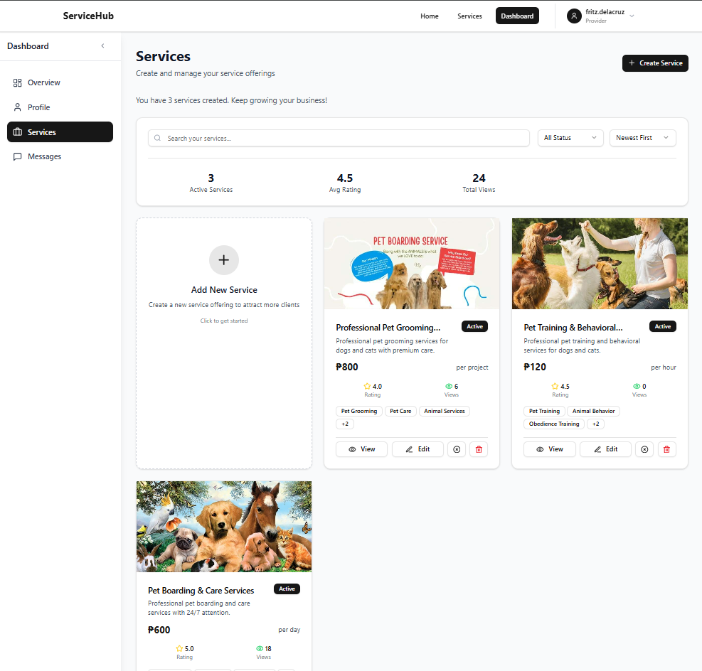

# Service Marketplace Platform

A comprehensive full-stack service marketplace platform enabling seamless connections between service providers and customers. Built with modern technologies and featuring real-time communication, geolocation services, and comprehensive review systems.

## 📸 Application Screenshots

### Home


### servivces


### Service Details



### Provider Dashboard



## 🚀 Features

### Core Functionality
- **User Authentication & Authorization** - Secure JWT-based authentication system
- **Service Provider Management** - Complete provider registration, verification, and profile management
- **Service Catalog** - Dynamic service listings with advanced search and filtering
- **Real-time Messaging** - Socket.io powered chat system between users and providers
- **Review & Rating System** - Comprehensive feedback mechanism for services and providers
- **Geolocation Services** - Location-based service discovery and mapping
- **Media Management** - Secure image upload and management for profiles and services
- **Responsive Design** - Mobile-first approach with dark/light theme support

### Administrative Features
- **Admin Dashboard** - Complete administrative control panel
- **Data Analytics** - Service and provider performance metrics
- **Content Moderation** - Review and approval workflows

## 🛠 Technology Stack

### Frontend
- **Framework**: React 18+ with Vite
- **Styling**: Tailwind CSS with shadcn/ui components
- **State Management**: React Context API
- **HTTP Client**: Axios
- **Real-time**: Socket.io Client

### Backend
- **Runtime**: Node.js 18+
- **Framework**: Express.js
- **Database**: MongoDB with Mongoose ODM
- **Authentication**: JWT (JSON Web Tokens)
- **File Upload**: Multer
- **Real-time**: Socket.io
- **Validation**: Custom middleware

## 📋 Prerequisites

- Node.js (v18.0.0 or higher)
- MongoDB (v6.0.0 or higher)
- npm or yarn package manager

## 🔧 Installation & Setup

### 1. Clone the Repository
```bash
git clone <repository-url>
cd v1
```

### 2. Backend Setup
```bash
cd backend
npm install
```

Create a `.env` file in the backend directory:
```env
# Server Configuration
PORT=5000
NODE_ENV=development

# Database
MONGO_URI=mongodb://localhost:27017/service_marketplace

# Authentication
JWT_SECRET=your_super_secure_jwt_secret_key_here
JWT_EXPIRES_IN=7d

# CORS Configuration
CORS_ORIGIN=http://localhost:5173

# File Upload Configuration
MAX_FILE_SIZE=10485760
UPLOAD_PATH=./uploads
```

### 3. Frontend Setup
```bash
cd ../frontend
npm install
```

Update the API configuration in `src/config/api.js`:
```javascript
export const API_BASE_URL = 'http://localhost:5000/api';
```

### 4. Database Setup
```bash
cd ../backend
npm run seed  # Optional: Populate with sample data
```

## 🚀 Running the Application

### Development Mode
Start both services in separate terminal windows:

**Backend Server:**
```bash
cd backend
npm run dev
```
Server will start at `http://localhost:5000`

**Frontend Application:**
```bash
cd frontend
npm run dev
```
Application will be available at `http://localhost:5173`

### Production Build
```bash
# Build frontend
cd frontend
npm run build

# Start backend in production mode
cd ../backend
npm start
```

## 📁 Project Architecture

```
v1/
├── backend/                    # Express.js API Server
│   ├── controllers/           # Route controllers
│   ├── middlewares/          # Custom middleware
│   ├── models/               # MongoDB schemas
│   ├── routes/               # API routes
│   ├── scripts/              # Database utilities & seeding
│   ├── uploads/              # File storage
│   ├── utils/                # Helper functions
│   ├── server.js             # Application entry point
│   └── socket.js             # Socket.io configuration
├── frontend/                  # React Application
│   ├── src/
│   │   ├── components/       # Reusable UI components
│   │   ├── pages/            # Page components
│   │   ├── contexts/         # React contexts
│   │   ├── hooks/            # Custom React hooks
│   │   ├── utils/            # Utility functions
│   │   └── config/           # Configuration files
│   └── public/               # Static assets
└── README.md                 # Project documentation
```

## 🔌 API Endpoints

### Authentication
- `POST /api/auth/register` - User registration
- `POST /api/auth/login` - User login
- `GET /api/auth/profile` - Get user profile

### Services
- `GET /api/services` - List all services
- `POST /api/services` - Create new service
- `PUT /api/services/:id` - Update service
- `DELETE /api/services/:id` - Delete service

### Providers
- `GET /api/providers` - List all providers
- `POST /api/providers/register` - Provider registration
- `GET /api/providers/:id` - Get provider details

*For complete API documentation, refer to the individual route files in `/backend/routes/`*

## 🧪 Available Scripts

### Backend Scripts
```bash
npm run dev          # Start development server with nodemon
npm start            # Start production server
npm run seed         # Seed database with sample data
npm test             # Run test suite (if configured)
```

### Frontend Scripts
```bash
npm run dev          # Start development server
npm run build        # Create production build
npm run preview      # Preview production build
npm run lint         # Run ESLint
```
## 🤝 Contributing

1. Fork the repository
2. Create a feature branch (`git checkout -b feature/AmazingFeature`)
3. Commit your changes (`git commit -m 'Add some AmazingFeature'`)
4. Push to the branch (`git push origin feature/AmazingFeature`)
5. Open a Pull Request

## 📄 License

This project is proprietary and confidential. All rights reserved.

## 📞 Support

For support and inquiries, please contact the development team.

---

**Built with ❤️ using the MERN Stack**